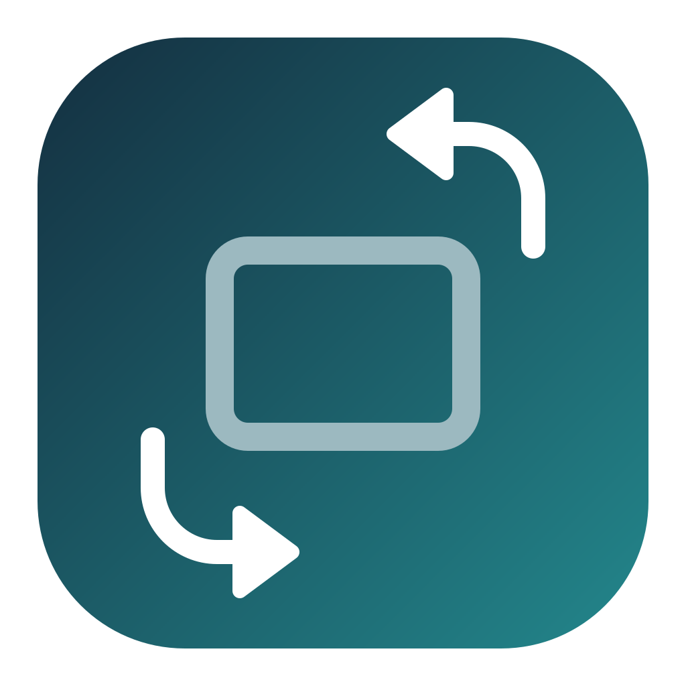

<div align="center">



# Rotator

**Rotate every Mac display from the menu bar — including the built-in MacBook display.**

[Download](https://github.com/B-HS/rotator/releases/latest) · [Features](#features) · [Install](#install) · [Development](#development)

</div>

Rotator is a small native macOS menu bar app for changing display orientation without digging through System Settings. Pick a connected display, choose 0°, 90°, 180° or 270°, and confirm the new orientation within ten seconds. If you do nothing, Rotator safely restores the previous setting.

## Features

- **Every display** — control the built-in MacBook panel and each connected external monitor independently
- **Four orientations** — switch between 0°, 90°, 180° and 270°
- **Live status** — the current orientation is always checked in each display submenu
- **Safe rollback** — keep the new setting within ten seconds or automatically return to the previous orientation
- **Menu bar only** — stays out of the Dock and uses the native macOS status area
- **Display-aware** — refreshes automatically as monitors are connected, disconnected or reconfigured
- **Native and small** — Swift, AppKit and CoreGraphics with no third-party runtime dependencies

## Install

Download the latest Universal macOS build from [Releases](https://github.com/B-HS/rotator/releases/latest), unzip it, and move **Rotator** into Applications.

- macOS 13 or later
- Apple Silicon and Intel
- Release builds are signed and notarized

## Usage

1. Open **Rotator**. A display-rotation icon appears in the menu bar.
2. Choose a display from the menu.
3. Select 0°, 90°, 180° or 270°.
4. Click **Keep** within ten seconds. Choose **Revert**, or wait, to restore the previous orientation.

The menu also includes a shortcut to the macOS Displays settings pane.

## Development

Xcode 15 or later is required.

```sh
swift test --disable-sandbox
swift run Rotator
```

The project is a Swift package with a small Objective-C bridge for macOS display APIs. Release packaging tools live in the sibling `publish-scripts` workspace so this repository contains only application source and CI configuration.

To create a local Universal `.app` and ZIP from the maintainer workspace:

```sh
PUBLISH_PROJECT_DIR="$PWD" ../publish-scripts/build-app.sh
open build/Rotator.app
```

## Signing and notarization

Validate credentials and register the required GitHub Actions secrets interactively:

```sh
PUBLISH_PROJECT_DIR="$PWD" \
PUBLISH_GITHUB_REPO="B-HS/rotator" \
../publish-scripts/setup-github-secrets.sh
```

Each value is validated immediately after entry. Secrets are hidden, never written into the repository, and uploaded only after the certificate and Apple notarization credentials pass validation.

Individual checks are also available:

```sh
../publish-scripts/verify-signing-cert.sh /path/to/developer-id.p12
../publish-scripts/verify-notary-credentials.sh
```

## Releases

Every push to `prod` runs tests, builds the Universal app, applies a hardened Developer ID signature, notarizes and staples the bundle, generates a SHA-256 checksum, and creates a GitHub Draft Release. Pushes to `dev` do not publish releases.

The release workflow expects these repository secrets:

| Secret | Purpose |
| --- | --- |
| `MACOS_CERTIFICATE_P12` | Base64-encoded Developer ID Application certificate |
| `MACOS_CERTIFICATE_PASSWORD` | Password for the `.p12` certificate |
| `APPLE_ID` | Apple Developer account email |
| `APPLE_APP_SPECIFIC_PASSWORD` | App-specific password for notarization |
| `APPLE_TEAM_ID` | Ten-character Apple Developer Team ID |
| `APPLE_SIGNING_IDENTITY` | Optional override; otherwise detected from the certificate |

## Technical note

CoreGraphics exposes the current display angle but no public API for changing it. Rotator loads macOS's MonitorPanel implementation at runtime and falls back to the legacy IOKit transform request when necessary. This makes built-in display rotation possible, but it also means Rotator is intended for direct distribution rather than the Mac App Store and may require updates after major macOS changes.

Some DisplayLink adapters, mirrored configurations or display drivers may reject rotation. A brief black screen while macOS reconfigures a display is normal.
